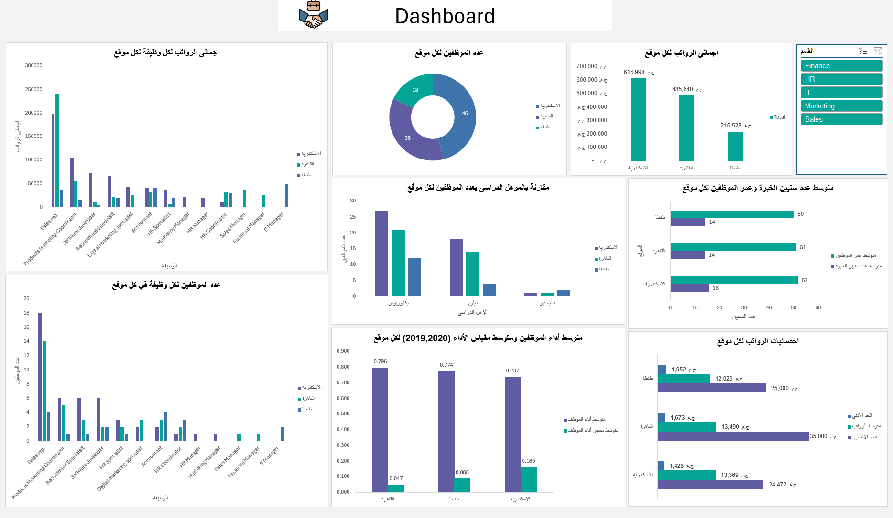

# Interactive HR Dashboard with Excel & Power Query

## Overview
This project features an **interactive HR analytics dashboard** built using **Excel and Power Query**. The dashboard consolidates employee data from multiple departments and provides key insights into salaries, experience, performance, and workforce demographics.

By leveraging **Power Query for ETL (Extract, Transform, Load)**, this project efficiently processes and analyzes HR data across different company branches.

## Features
- **Data Consolidation**: Merged data from **five departments**: IT, Finance, Sales, Marketing, and HR.
- **Automated Data Cleaning & Transformation** using **Power Query**.
- **Dynamic Visualizations**: Interactive charts and graphs for better decision-making.
- **Key HR Metrics**:
  - Employee Count per Location
  - Salary Distribution
  - Education Level Comparison
  - Experience & Age Calculation
  - Performance Evaluation
  - **Average Total (2019, 2020) & Delta (Rep 2020 – Rep 2019)**

## Data Transformations
### Using **Power Query**, the following transformations were applied:
- **Appending Multiple Sheets**: Merged five department-specific worksheets into one dataset.
- **Data Type Corrections**: Converted **Birth Date** & **Hiring Date** from text to date format.
- **New Calculated Fields**:
   - **Employee Age**
   - **Years of Experience**
   - **Average Total for 2019 & 2020**
   - **Delta (Rep 2020 – Rep 2019)**
- **Data Cleaning**: Removed inconsistencies and ensured accurate reporting.

## Charts & Visuals
The dashboard includes:
- **Employee Count by Location** (Pie Chart)
- **Total Salaries by Location & Job Title** (Bar Charts)
- **Average Experience & Age by Branch** (Bar Chart)
- **Education Level Breakdown** (Clustered Column Chart)
- **Salary Statistics & Performance Trends**
- **Average Total & Delta Comparison (2019, 2020)**

## Key Insights
- The **highest salaries** are concentrated in certain departments & locations.
- **Experience & education levels** vary significantly across branches.
- Employees’ **years of experience** impact their performance trends.
- **Average Total & Delta metrics** help in tracking performance changes over time.
- Using **Power Query** simplified the **ETL process**, improving efficiency.

## Screenshot

## Connect with Me
If you have any questions or suggestions, feel free to connect with me on **[LinkedIn](https://www.linkedin.com/in/nada-saied-521776342/)** or check out more of my projects!

